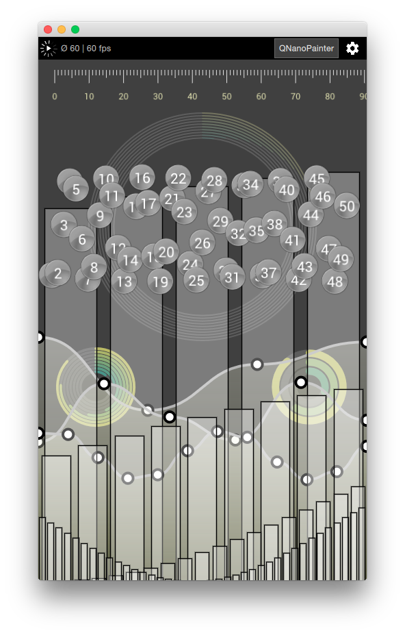
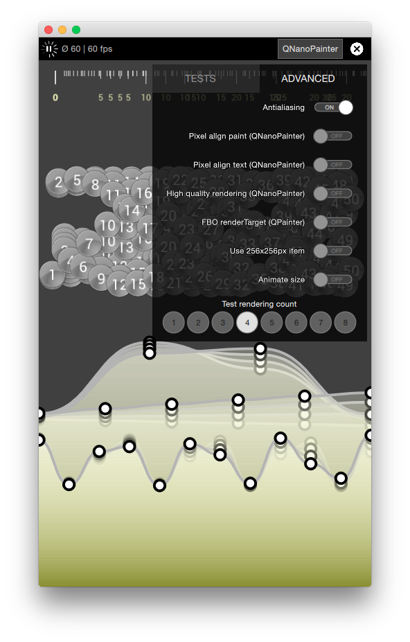
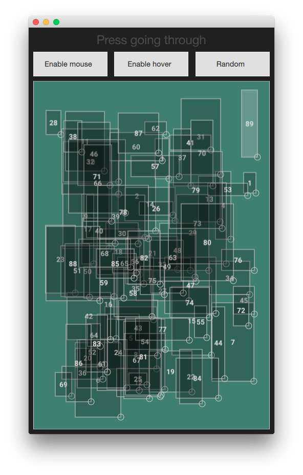
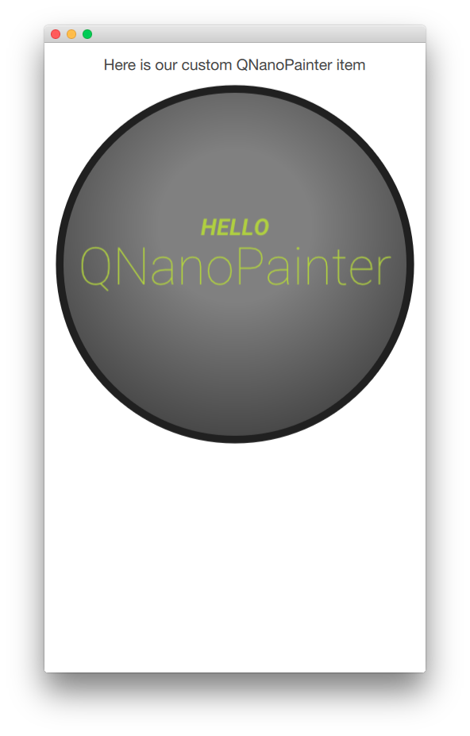
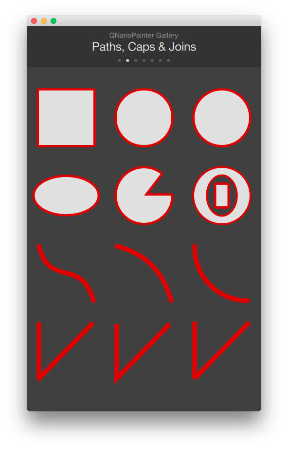
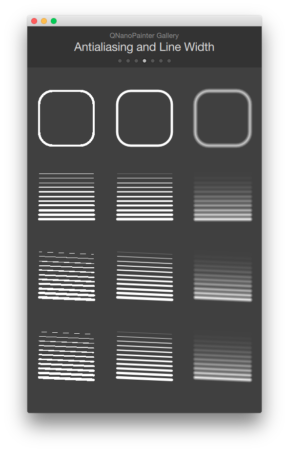
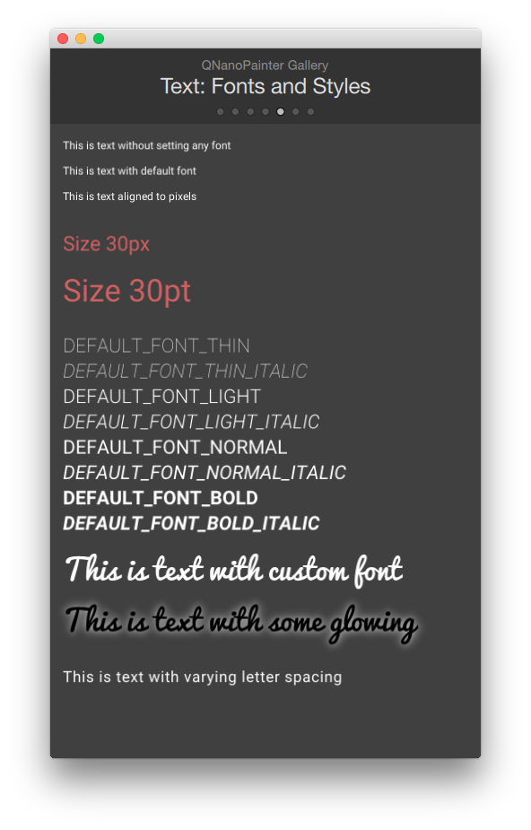

# QNanoPainter

QNanoPainter is an OpenGL accelerated C\++ vector drawing library for Qt, offering optimal performance, productivity and rendering quality all-in-one. QNanoPainter API is a mixture of QPainter and HTML5 canvas APIs. In other words, it's very close to HTML5 canvas but transformed to object oriented C++ with separate classes.

QNanoPainter can be used together with Qt5 UIs in different ways:

* Use QNanoQuickItem and QNanoQuickItemPainter when implementing custom C\++ Qt [QQuickItems](http://doc.qt.io/qt-5/qquickitem.html). This is comparable to [QQuickPaintedItem](http://doc.qt.io/qt-5/qquickpainteditem.html), but instead of QPainter offers own QNanoPainter API for drawing.
* Use QNanoWidget when implementing custom QWidget. This is based on [QOpenGLWidget](http://doc.qt.io/qt-5/qopenglwidget.html).
* Use QNanoWindow when implementing single-view UI, optimal for embedded usage. This is based on [QOpenGLWindow](http://doc.qt.io/qt-5/qopenglwindow.html).

QNanoPainter uses excellent [NanoVG](https://github.com/memononen/nanovg) as its rendering backend.


## Screenshots





## Features

Here is a non exhaustive list of QNanoPainter features:

* **Vector drawing**: Path-based drawing of rectangles, circles, lines etc. filled and/or stroked. Brush can be color, gradient or image pattern. Different cap and join options for stoked lines.
* **Images**: Transformed images or rectangular areas of images. Mipmapping for smoother rendering of scaled images.
* **Text**: Contains set of default fonts and supports loading custom truetype fonts. Text aligning and wrapping. Letter-spacing and blur for shadow/glow effect.
* **Antialiasing**: Adjustable antialiasing amount for vector drawing.
* **Pixel aligning**: Drawing and texts can be either freely positioned (smooth animations) or aligned to pixels (sharp rendering).
* **Extra**: Supports high-DPI retina resolutions, global alpha, transforms, painter states etc.


## Usage

Taking QNanoPainter into use in your Qt application is simple:

* Copy 'libqnanopainter' directory into your project. Sources are included directly instead of building separate static/dynamic library which makes usage simple and allows easier customization of QNanoPainter itself.
* In your project .pro file, include QNanoPainter with something like:


```
include(src/libqnanopainter/include.pri)
```
### For custom QQuickItem

* Implement your QNanoQuickItem and QNanoQuickItemPainter based classes (see more about these below or from available examples).
* Export your item into QML in main.cpp with something like: 

```
qmlRegisterType<MyQNanoItem>("MyQNanoItem", 1, 0, "MyQNanoItem");
```

* Use your item in QML:

```
import QtQuick 2.4
import MyQNanoItem 1.0

Item {
	...
	MyQNanoItem {
		anchors.fill: parent
	}
}
```

To create own QNanoPainter item you should implement 2 classes:

* **QNanoQuickItem**: This will be the visual QQuickItem providing API towards QML side. Your painter will be created and attached to item in *createItemPainter()* method.
* **QNanoQuickItemPainter**: This will handle the drawing using QNanoPainter API in the *paint()* method. Data with the item will be transferred in *synchronize()* method.

The main reason for two classes is that these will run in separate threads for optimal performance. And because of this, all communication between these two need to happen in *synchronize()* method.

Here is a complete HelloWorld example item:

```C++:
#include "qnanoquickitem.h"
#include "qnanoquickitempainter.h"

// HelloItemPainter contains the painting code
class HelloItemPainter : public QNanoQuickItemPainter
{
    Q_OBJECT

public:
    HelloItemPainter()
    {
    }

    void paint(QNanoPainter *p)
    {
        // Paint the background circle
        p->beginPath();
        p->circle(width()*0.5, height()*0.5, width()*0.46);
        QNanoRadialGradient gradient1(width()*0.5, height()*0.4, width()*0.6, width()*0.2);
        gradient1.setStartColor("#808080");
        gradient1.setEndColor("#404040");
        p->setFillStyle(gradient1);
        p->fill();
        p->setStrokeStyle("#202020");
        p->setLineWidth(width()*0.02);
        p->stroke();
        // Hello text
        p->setTextAlign(QNanoPainter::ALIGN_CENTER);
        p->setTextBaseline(QNanoPainter::BASELINE_MIDDLE);
        QNanoFont font1(QNanoFont::DEFAULT_FONT_BOLD_ITALIC);
        font1.setPixelSize(width()*0.08);
        p->setFont(font1);
        p->setFillStyle("#B0D040");
        p->fillText("HELLO", width()*0.5, height()*0.4);
        // QNanoPainter text
        QNanoFont font2(QNanoFont::DEFAULT_FONT_THIN);
        font2.setPixelSize(width()*0.18);
        p->setFont(font2);
        p->fillText("QNanoPainter", width()*0.5, height()*0.5);
    }
};

// HelloItem provides the API towards QML
class HelloItem : public QNanoQuickItem
{
    Q_OBJECT

public:
    HelloItem(QQuickItem *parent = 0)
        :  QNanoQuickItem(parent)
    {
    }

    // Reimplement
    QNanoQuickItemPainter *createItemPainter() const
    {
        // Create painter for this item
        return new HelloItemPainter();
    }
};
```

### For custom QWidget or QWindow

Implement your own QNanoWidget or QNanoWindow subclass depending on your needs. APIs of these are very similar, basically you just override *paint()* method like this:

```C++:
#include "qnanowindow.h"
#include "qnanopainter.h"

class HelloWindow : public QNanoWindow
{
public:
    HelloWindow()
    {
        setFillColor("#ffffff");
    }

    void paint(QNanoPainter *p)
    {
        // Paint using QNanoPainter here
        ...
    }
};
```


## API Reference

Sources contain API documentation written with [QDoc](http://doc.qt.io/qt-5/qdoc-index.html). To generate the documentation:

```
> cd doc
> [Qt bin path]/qdoc qnanopainter.qdocconf 
```
Documentation is work-in-progress, patches welcome =)


## License

The library is licensed under [zlib license](LICENSE.txt).


## Links

* Uses [Qt framework](http://www.qt.io).
* Uses [NanoVG](http://github.com/memononen/nanovg) library as rendering backend.
* Uses Google Fonts [Roboto](http://www.google.com/fonts/specimen/Roboto) (and [Pacifico](http://www.google.com/fonts/specimen/Pacifico) in gallery example).
* Blog posts:
  * [Introducing QNanoPainter](http://kgronholm.blogspot.fi/2015/10/introducing-qnanopainter.html)
  * [QNanoPainter with Qt 5.8 (and QSGRenderNode)](http://kgronholm.blogspot.fi/2017/03/qnanopainter-with-qt-58-and.html)
  * [FitGraph NG UI prototype](http://kgronholm.blogspot.fi/2017/10/fitgraph-ng-ui-prototype.html)
  * [Qt 5.10 Rendering Benchmarks](http://kgronholm.blogspot.fi/2017/12/qt-510-rendering-benchmarks.html)
  * [Qt 5.10 Windows Rendering Benchmarks](http://kgronholm.blogspot.fi/2018/01/qt-510-windows-rendering-benchmarks.html)
  * [Qt painting performance with 4 different embedded GPUs (Mali, Adreno, PowerVR)](http://kgronholm.blogspot.com/2019/03/qt-painting-performance-with-4.html)
  * [Qt Quick 3D DynamicMeters demo](http://kgronholm.blogspot.com/2020/04/qt-quick-3d-dynamicmeters-demo.html)
